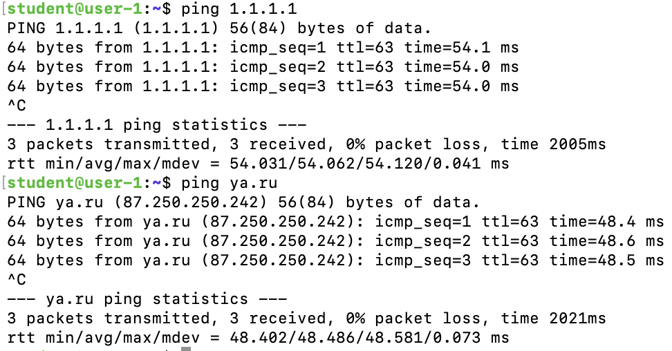
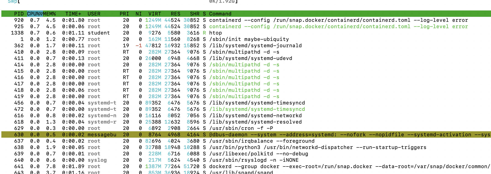

# Операционные системы UNIX/Linux (Базовый).

## Part 1. Установка ОС

> Подлючение к виртуальной машине через терминал и получение версии системы.
---
## Part 2. Создание пользователя

> - Создание нового пользователя и добавление его в группу adm.
> - Результат вывода команды cat /etc/passwd.


> Результат вывода команды cat /etc/group чтобы увидеть что новый пользователь является участником группы adm.
---
## Part 3. Настройка сети ОС

> Задать название машины вида user-1


> Установить временную зону, соответствующую вашему текущему местоположению.


> - Вывести названия сетевых интерфейсов с помощью консольной команды.
> - lo (loopback device) – виртуальный интерфейс, присутствующий по умолчанию в любом Linux. Он используется для отладки сетевых программ и запуска серверных приложений на локальной машине. С этим интерфейсом всегда связан адрес 127.0.0.1.


> - Используя консольную команду получить ip адрес устройства, на котором вы работаете, от DHCP сервера.
> - DHCP (англ. Dynamic Host Configuration Protocol — протокол динамической настройки узла) — прикладной протокол, позволяющий сетевым устройствам автоматически получать IP-адрес и другие параметры, необходимые для работы в сети TCP/IP.


> Внешний ip-адрес шлюза.


> Внутренний IP-адрес шлюза.


> Прописал статичные ip, gw, dns.


> Проверил интернет.
---
## Part 4. Обновление ОС
```
sudo apt update
sudo apt upgrade
sudo do-release-upgrade
```

> Следуем инструкции в терминале.


> Проверяем обновления.
---
## Part 5. Использование команды sudo
> Команда sudo служит механизмом для предоставления прав администратора, которые обычно доступны только пользователю root, для обычных пользователей.


> Изменил hostname.
---
## Part 6. Установка и настройка службы времени
> Network Time Protocol (NTP) - это протокол, используемый для автоматической синхронизации системных часов компьютера по сети. Машина может устанавливать системные часы по всемирному координированному времени (UTC), а не по местному времени.
```
sudo apt install ntpdate
sudo ntpdate 1.ru.pool.ntp.org (Синхронизируем время)
ps -ef | grep ntpd (проверяем что процесс запущен)
```

> Выводом команды timedatectl show
---
## Part 7. Установка и использование текстовых редакторов
```
sudo apt install joe
```


```
VIM - Esc / :wq
NANO - ^O / Enter / ^X
JOE - ^K / Q / y
```
---


```
VIM - Esc / :q!
NANO - ^O / n
JOE - ^C / y
```
---


> Поиск и замена слова в VIM
---


> Поиск и замена слова в NANO через ( ^\ )
---


> Поиск и замена слова в JOE
> ^K + f, вводим искомое слово, указываем опции (b - нужен для поиска назад,r - замена), вводим слово на замену.
---
## Part 8. Установка и базовая настройка сервиса SSHD
```
sudo apt install openssh-server (Установить службу SSHd.)
sudo systemctl enable ssh (автостарт службы при загрузке системы.)
sudo vi /etc/ssh/sshd_config (Изменил порт)
sudo systemctl restart ssh (Перезапуск службы SSHd)
```

> Процесс запущен. Для поиска использовал ps с опциями: -e (показать все процессы), -f (вывод подробной информации о потоках). grep для форматирования.
---

> Опции: -t (tcp порт), -a (все порты), -n (вывод значений в цифровом формате)

### Значение каждого столбца:
- Proto: протокол, используемый сокетом
- Recv-Q: количество байтов, не скопированных пользовательской программой, подключенной к этому сокету.
- Send-Q: количество неподтвержденных байтов удаленного хоста
- Локальный адрес: локальный адрес (имя локального хоста) и номер порта сокета. Если не указана опция -n, адрес сокета разрешается в соответствии с полным именем хоста (FQDN), а номер порта преобразуется в соответствующее имя службы.
- Внешний адрес: удаленный адрес (имя удаленного хоста) и номер порта сокета.
- State: состояние сокета.
---
## Part 9. Установка и использование утилит top, htop

> - В самой верхней строке показано: текущее время в системе, аптайм (время работы после загрузки), общее количество пользователей и средняя нагрузка за последние 1, 5 и 15 минут.
> - Далее идут строки с информацией о: задачах, процессоре, оперативной памяти, разделе подкачки.
> - По умолчанию сортировка выполняется по количеству использования цп.Для переключения между разными колонками (выбора другой характеристики для сортировки) используйте клавиши < и > + Shift.
---





---
## Part 10. Использование утилиты fdisk
> sda / 16 GiB - 17179869184 bytes, 33554432 sectors / 1.9Gi
```
sudo fdisk -l ( без sudo нет прав)
free -h (Покажет размер SWAP)
```
---
## Part 11. Использование утилиты df


---
## Part 12. Использование утилиты du


---
## Part 13. Установка и использование утилиты ncdu
```
sudo apt install ncdu
```


---
## Part 14. Работа с системными журналами


> - /var/log/syslog или /var/log/messages содержит глобальный системный журнал, в котором пишутся сообщения с момента запуска системы, от ядра Linux, различных служб, обнаруженных устройствах, сетевых интерфейсов и много другого.
> - /var/log/auth.log или /var/log/secure — информация об авторизации пользователей, включая удачные и неудачные попытки входа в систему, а также задействованные механизмы аутентификации.
> - /var/log/dmesg — драйвера устройств. Одноименной командой можно просмотреть вывод содержимого файла. Размер журнала ограничен, когда файл достигнет своего предела, старые сообщения будут перезаписаны более новыми. Задав ключ --level= можно отфильтровать вывод по критерию значимости.
---
## Part 15. Использование планировщика заданий CRON


